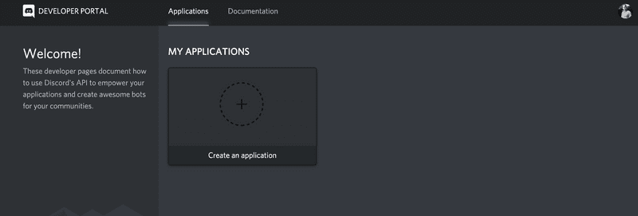
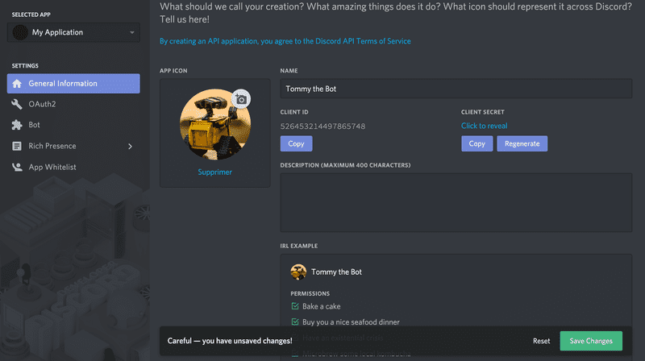
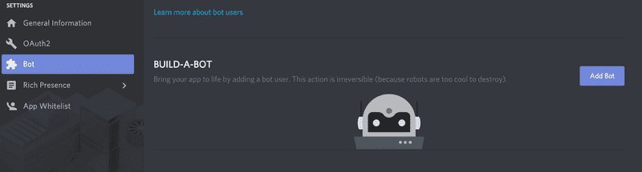
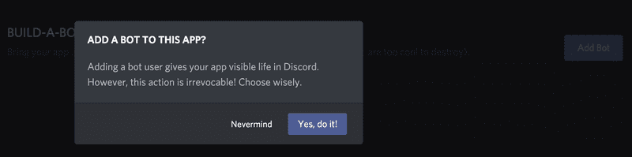
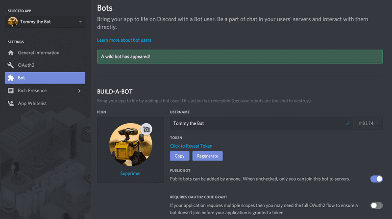
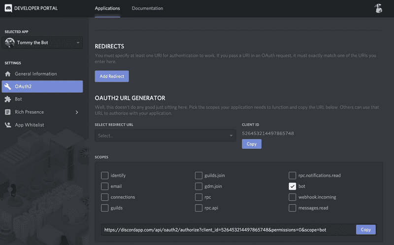
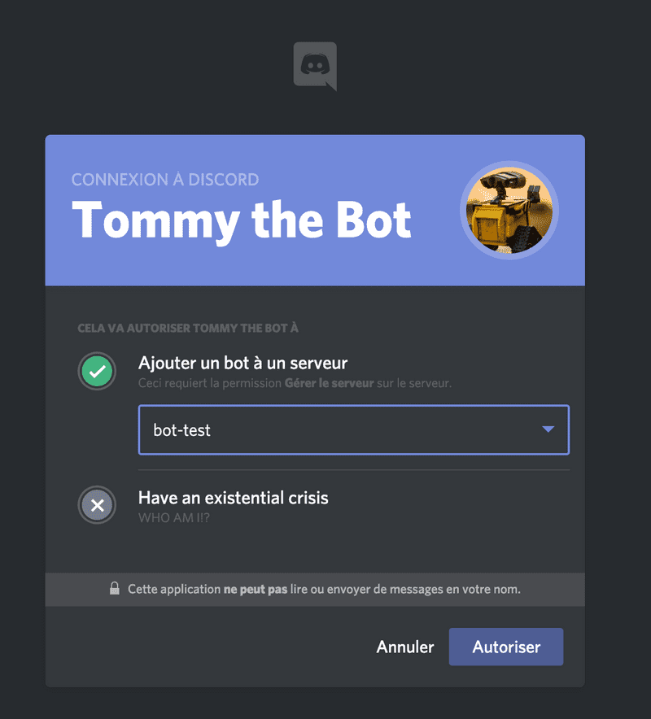
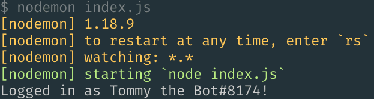

# Create a Discord bot under 15 minutes


**Discrod** adalah salah satu aplikasi obrolan yang populer saat ini, terutama untuk para gamer dan pengembang. Banyak orang menyukainya karena gratis, efisien, lintas platform, multi-fungsi dan lain-lain.

Ada beberapa hal yang dapat dilakukan pada Discord sebagai contoh, kamu mungkin menemukan salah satu dari beberapa server dikasih ucapan selamat, meningkatkan level kamu setelah kamu mengirim banyak pesan di server, mendengarkan musik, bermain game, untuk menendang atau melarang anggota, dll.

Lantas, bagaimana cara membuat bot discord? Ternyata tidaklah susah untuk membuat/mengembangkan bot discord. Jika mengikuti sesuai arahan tidak ada kata "_**Tidak bisa ...!**_" jadi, tanpa basa-basi mari kita mulai tentang cara membuat bot discord.

---

## Getting Started

Pada proyek kali ini, kamu butuh [Node.js](https://nodejs.org/en/) dan [npm](https://www.npmjs.com/) _atau_ [yarn](https://yarnpkg.com/lang/en/) sebelum memulainya. Dan seperti biasanya, kamu perlu melakukan beberapa pengaturan saat memulai proyek. Hal-hal yang perlu diperhatikan dalam proyek ini:

1. Mempersiapkan segala sesuatu yang dibutuhkan dalam proyek ini;
2. Buat aplikasi **Discord** dan ambil token untuk menggunakan **API** mereka;
3. Tambahkan bot ke server discord. Buat jika belum/tidak ada server discord; dan
4. Uji coba bot discord.

_**Mudah dilakukan jika tertib ikuti instruksi!**_

---

## Get that token

1. Kunjungi halaman [Discord’s Developer](https://discordapp.com/developers/applications/) dan klik pada **Create an application**
   
2. Isi kolom **NAME** dan pilih avatar sesuai selera kamu. Lalu klik **Save Changes**. Kamu akan melihat pesan umpan balik yang mengatakan "_All your edits have been carefully recorded_"
   
3. Pada panel sebelah kiri, pilih menu **Bot** lalu klik **Add Bot**
   
4. Jika muncul popup, klik **Yes, do it!**. Tergantung dari nama aplikasi kamu, kamu akan mendapat pesan error "_Too many users have this username, please try another_". Maka dari itu, pilih nama lain untuk aplikasi kamu
   
5. Setelah itu, kamu akan mendapatkan pesan "_A wild bot has appeared!_"
   
6. Klik tombol **COPY** dan taruh di file `config.json` pada parameter `bot_token`

---

## Setup local project

1. Dalam proyek ini, **base-os** menggunakan **linux** bagi yang os **windows** harap bisa menyesuaikan
2. Duplikat project berikut ke folder lokal kamu, mis. **discordbot**

   ```bash
   git clone https://github.com/archytech99/discordbot-master.git
   ```

3. Didalam paket sudah terdapat printah/event yg sudah tersedia
   * kick, perintah untuk mengeluarkan member dari server discord
   * help, perintah untuk menampilkan daftar bantuan perintah yang tersedia
   * say, perintah untuk mengulangi pesan yang sudah diketik
   * welcome, pesan sambutan untuk member yang baru join server discord secara private (**DM**)
   * mention, membalas pesan member yang menyebut nickname bot discord
4. Buat file `config.json` lalu copy kode berikut dan update `"..."` sesuai informasi yang dibutuhkan

   ```json
   {
    "bot_name" : "...",
    "bot_prefix" : "...",
    "bot_token" : "...",
    "server" : "...",
    "author" : "...",
    "email" : "..."
   }
   ```

5. Buka terminal masuk ke folder dimana proyek cloning tadi. Lalu ketik perintah perintah berikut

   ```bash
   npm install
   ```

   _note: Jika ada muncul pesan warning, harap disesuaikan dengan pesan tersebut_
Sejauh ini, kita sudah selesai untuk persiapan, mendapatkan token bot. Selanjutnya buat _link invitation_ untuk bot.

---

## Add our bot to server

1. Kembali ke [Developer Portal](https://discordapp.com/developers/applications/) dan klik **OAuth2** pada panel kiri. Dibawah **SCOPES**, pilih/cek **bot**, lalu, klik **Copy**. Untuk hak akses sesuaikan dengan kebutuhan
   
2. Buka tab baru pada browser kamu dan buka **URL's** yang sudah kamu salin tadi. Pilih server kamu dan klik **Authorize**
   
3. Dan Selamat, bot kamu sudah barhasil join ke server kamu.
4. Untuk membuat status online pada bot kamu perlu ketik perintah

   ```bash
   npm start
   ```

5. Jika berjalan lancar, harusnya muncul seperti gambar berikut
   
6. Kembali ke server kamu dan coba testimoni perintah yang sudah tersedia

---

## More information

Untuk info lebih lanjut seputar `discordbot`, bisa join ke server discord [saya](https://discord.com/invite/DNNrw8J)
